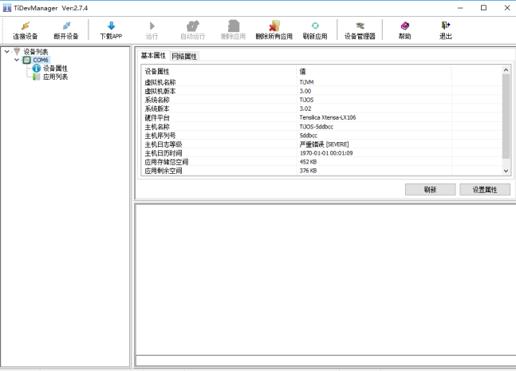

# TiGW200 可编程4G边缘计算网关开发指南

TiGW200是钛云物联基于钛极OS(TiJOS)物联网操作系统开发的4G可编程边缘计算网关， 用户可通过Java语言开发控制器内部的应用和控制逻辑以及与云平台交互过程。 

在使用TiGW200可编程边缘计算网关开发之前 ，建议用户先通过钛极OS(TJOS)物联网开发套件熟悉相关的开发过程，相关套件可通过在线商城进行购买, 在本产品的SDK中包含了部分教程方便用户快速了解开发过程。 

## 准备开发环境

### 安装TiStudio

在进行开发之前 ，请先安装Eclipse开发环境及TiStudio开发插件，请参考如下链接进行开发环境的安装。 

[炼制驾驭小龟法宝与法宝试用—开发环境搭建与开发板测试 - 文档中心 (tijos.net)](http://dev.tijos.net/docstore/tijos-development-course2/introductory/LESSON3/tistudio_and_tikit_verification/)

### 创建TiJOS Application工程

TiGW200提供了相关例程，用户可直接使用Eclipse打开例程进行修改或者新建一个TiJOS Application工程，具体过程请参考[欢迎来到TiJOS世界—新建工程Hello TiJOS - 文档中心](http://dev.tijos.net/docstore/tijos-development-course2/introductory/LESSON5/hello_tijos/)

 在新建工程后， 将TiGW200-1.0.x.jar加入到工程中， 将在工程属性中将该Jar包加入到Java Build Path中，如下图所示：


### 编码

此时，即可在Eclipse中进行相应的代码编写。

### 下载、运行

代码无误后， 可通过Run As菜单选择"TiJOS Application"运行， 在运行之前请确保已正确连接在TiBOX的USB编程口， 可从TiJOS LogCat中查看日志或打开TiDevManager查看日志。


## TiDevManager设备管理器

TiDevManager设备管理器是钛极OS(TiJOS)开发套件TiStudio的组成部分， 用于查看设备信息及应用管理的工具，也可单独运行，详细使用方法请参考[初识TiDevManager设备管理器 - 文档中心 (tijos.net)](http://dev.tijos.net/docstore/tijos-development-course/step2-device_manager/about_tidevmanager/)

TiDevManager可通过Eclipse的菜单启动。


启动后， 可连接设备查看设备及应用信息




## TiGW200  编程开发说明

TiGW200 内置钛极OS(TiJOS) 操作系统， 支持通过Java语言进行应用开发，可通过钛极OS(TiJOS) 开发工具链IDE进行应用开发， 钛极OS(TiJOS)在线文档可参考 doc.tijos.net

### TiGW200 Java类使用说明

#### 外设访问

tigateway.TiGW200类提供了TiGW200所支持的硬件资源访问， 包括RS485, LED等，同时内置看门狗，用户可通过在TiStudio中进行简单的开发即可支持各种应用， 同时提供了的MODBUS协议类， 可以很方便地与支持MODBUS RTU协议的设备进行数据交互。 

##### RS485

TiGW200支持2路RS485, 对应于通道1，通道2， 每1路支持最大驱动32个RS485从设备。 

##### 可控LED 

TiGW200提供1个红色电源指示灯和2个可编程控制LED灯，对应于蓝色和绿色， 方便用户在代码中指示设备的当前状态， 建议蓝色灯用于指示4G网络通讯状态， 绿色灯用于指示RS485通讯状态。

##### 输出电源

为了方便用户连接RS485设备或传感器， TiGW200提供一路DC12-24V输出电源，节省用户适配器成本。 

##### 看门狗Watchdog

TiGW200内置硬件看门狗， 在TiGW200.getInstance()中会自动启动，用户无需处理。


## TiGW200 外设访问组件

为了方便用户在程序中访问外设， TiGW200提供了JAVA类开源组件

| 方法                                                | 说明                                                         |
| --------------------------------------------------- | ------------------------------------------------------------ |
| **RS485**                                           |                                                              |
| TiRS485 getRS485(int chn, int baudRate, int parity) | 获取RS485接口， 参数：通道（0或1）波特率，校验位，（数据位，停止位固定为8,1) |
| **LED灯**                                           |                                                              |
| TiLED blueLED()                                     | 获取蓝色灯对象                                               |
| TiLED greenLED()                                    | 获取绿色灯对象                                               |
|                                                     |                                                              |

### TiRS485串口类主要方法使用说明

通过getRS485获取串口后，即可对串口进行读写操作

#### 写入数据write

void write(byte[] request, int reqLen, int recvLen, int recvTimeout)

写入数据到串口

recvLen, recvTimeout用于设置RS485设备返回数据的长度和最大超时时间，可根据设备的通讯协议和规格进行设置，如果不确定，可使用设备设计的最大时间

| 参数        | 说明                                                         |
| ----------- | ------------------------------------------------------------ |
| request     | 待写入数据缓存区                                             |
| reqLen      | 写入数据长度                                                 |
| recvLen     | 期望返回数据长度，如果不确定可设置最大长度                   |
| recvTimeout | 返回数据最大超时时间，如果不确定可设置设备返回结果的最大时间 |


#### 读取数据read

byte[] read(int timeout) 

从串口读取数据，参数timeout为最大超时

**返回值 **： 读取到的数据 ，返回null为无数据


### TiLED灯主要方法使用说明

通过blueLED/greenLED可以获取蓝灯和绿灯对角，并进行如下操作

#### 开灯turnOn

指定的灯亮

#### 关灯turnOff

指定的灯灭

#### 灯闪

可通过turnOn/turnOff组合实现灯闪效果， 为不影响主程序运行，也可启动一个专门的线程来实现闪烁的效果。


## MODBUS RTU组件

Modbus 一个工业上常用的通讯协议, 其中MODBUS-RTU在支持串口的设备中最为常用， 目前市面上很多设备和传感器都提供MODBUS-RTU的协议支持。 

TiGW200提供了相应的MODBUS RTU组件方便用户在代码中直接访问MODBUS RTU设备。

### 主要接口

| 函数                                                         | 说明                                                         |
| ------------------------------------------------------------ | ------------------------------------------------------------ |
| ModbusClient(TiRS485 serialPort,  int timeout)               | 初始化，serialPort: RS485通讯对象， timeout: RS485设备通讯超时时间 |
| **初始化寄存器请求**                                         | 根据参数构造MODBUS寄存器请求                                 |
| initReadCoilsRequest(int deviceId, int startAddress, int count) | 初始化Read Coils 请求                                        |
| initWriteCoilRequest(int deviceId, int coilAddress, boolean value) | 初始化WRITE COIL register 请求- 单寄存器操作i                |
| initWriteCoilsRequest(int deviceId, int startAddress, boolean[] values) | 初始化WRITE MULTIPLE COILS registers 请求- 多寄存器操作      |
| initReadHoldingsRequest(int deviceId, int startAddress, int count) | 初始化READ HOLDING REGISTERs 请求                            |
| initReadDInputsRequest(int deviceId, int startAddress, int count) | 初始化READ DISCRETE INPUT REGISTERs 请求                     |
| initReadAInputsRequest(int deviceId, int startAddress, int count) | 初始化READ INPUT REGISTERs 请求                              |
| initWriteRegisterRequest(int deviceId, int regAddress, int value) | 初始化WRITE SINGLE REGISTER 请求 - 单寄存器操作              |
| initWriteRegistersRequest(int deviceId, int startAddress, int[] values) | 初始化WRITE MULTIPLE 请求 - 多寄存器操作                     |
| **执行请求**                                                 | 发送MODBUS请求到设备并获取返回数据                           |
| int execRequest()                                            | 执行MODBUS 请求并获得MODBUS响应结果                          |
| int getResponseAddress()                                     | 获取返回的MODBUS寄存器开始地址                               |
| int getResponseCount()                                       | 获取返回的MODBUS寄存器个数                                   |
| boolean getResponseBit(int address)                          | 获取指定地址COIL寄存器值， 对应于InitReadCoilsRequest/InitReadDInputsRequest |
| int getResponseInt16(int address, boolean unsigned)          | 获取指定地址InputRegister/HoldingRegister的值， unsigned: 返回值 为无符号或有符号整数 |
| int getResponseInt32(int address, boolean bigEndian)         | 获取指定地址InputRegister/HoldingRegister的连续2个寄存器值组成1个32位有符号整数， bigEndian:是否为大端格式 |
| float getResponseFloat(int address, boolean bigEndian)       | 获取指定地址InputRegister/HoldingRegister的连续2个寄存器值组成1个32位浮点数， bigEndian:是否为大端格式 |

#### 参数说明

**deviceId** - MODBUS 设备地址

**startAddress** - MODBUS 寄存器开始地址

**count** - 寄存器个数 

**regAddress** - MODBUS 寄存器地址


### 调用过程

MODBUS 组件的调用过程一般为：

1. 指定串口实例化MODBUS对象，ModbusClient(TiRS485 serialPort,  int timeout)

2. 初始化MODBUS寄存器读写操作请求， initXXXRequest 

3. 执行MODBUS请求并返回结果 execRequest

4. 根据设备协议中定义的数据类型获取返回的寄存器值 getResponseBit/getResponseInt16/getResponseInt32/getResponseFloat

   

### 例程

**场景**：

设备通过RS485连接到TiGW200， 通讯MODBUS RTU协议进行数据交互

**设备通讯参数**

| 参数    | 值   |
| ------- | ---- |
| 设备 ID | 1    |
| 波特率  | 9600 |
| 校验位  | 无   |

**寄存器**： INPUT REGISTER  (03)  

| 寄存器地址 | 内容     | 操作权限 | 数值范围                                           |
| ---------- | -------- | -------- | -------------------------------------------------- |
| 0x0000     | 空气湿度 | 只读     | 0x00(0)--0x03E7(999) 对应 0%--99.9% 数值放大了10倍 |
| 0x0001     | 空气温度 | 只读     | 0x8190(-400)--0x0320(800) 对应 -40℃--80℃ 负数      |

源码请参考： https://github.com/TiJOSteam/TiGW200-Cat1/blob/main/SDK/sample/modbus-rtu/src/modbusSample.java

#### 代码调用过程

1. 打开RS485并获取TiRS485对象

   ```java
   TiGW200 gw200 = TiGW200.getInstance();
   //获取RS485通道1 
   TiRS485 rs485 = gw200.getRS485(0, 9600, TiUART.PARITY_NONE);
   ```

2. 创建MODBUS协议对象并挂接RS485

  ```java
   //MODBUS 客户端  
   //通讯超时2000 ms 
   ModbusClient modbusRtu = new ModbusClient(rs485, 2000);
  ```

3. 通过MODBUS协议读取寄存器数据 

   ```java
      // MODBUS device address 设备地址
      int deviceId = 1;
      // Input Register 寄存器开始地址
      int startAddr = 0;
      // Read 2 registers from start address 读取个数
      int count = 2;
      
     //初始读取Holding Register参数， 设备地址， 寄存器开始地址， 个数
      modbusRtu.initReadHoldingsRequest(deviceId, startAddr, count);
      int result = modbusRtu.execRequest();
      
      //读取成功进行数据解析
      if (result == ModbusClient.RESULT_OK) {
          //获取第1个寄存器值 - 温度
      	int temperature = modbusRtu.getResponseInt16(startAddr, false);
          //获取第2个寄存器值 - 湿度
      	int humdity = modbusRtu.getResponseInt16(startAddr + 1, false);
      }
   ```


## 网络访问

TiGW200支持 4G Cat1网络， 基于运营商现有的手机网络即可接入云平台。 

用户可通过钛极OS运行库中TiLTE来进行4G Cat1网络的控制， 在程序运行开始通过startup来启动网络即可。 

### LTE网络设置 - TiLTE

TiLTE中包含了所有与LTE网络相关的操作和设置 
TiLTE为单例，在操作网络时可通过getInstance获得实例并调用相应的方法。

主要方法如下：

| 方法                                            | 说明                                               |
| ----------------------------------------------- | -------------------------------------------------- |
| TiLTE getInstance()                             | 获取LTE实例                                        |
| void startup(int timeout)                       | 启动LTE并连接基站, timeout以秒为单位               |
| void startup(int timeout, ILTEEventListener lc) | 启动LTE并连接基站， 当基站连接或断开时通过事件通知 |
| void shutdown()                                 | 关闭LTE                                            |
| String getIMEI()                                | 获取模组IEMI字符串                                 |
| String getIMSI()                                | 获取SIM卡IMSI字符串                                |
| void getICCID()                                 | 获取SIM卡CCID字符串                                |
| String getPDPIP()                               | 获取当前IP地址                                     |
| int getRSSI()                                   | 获取当前信号强度                                   |
| TiLTECell getCellInfo()                         | 获取基站信息                                       |

TiLTE类中他方法的技术说明请参考TiJOS Framework说明文档。


源码请参考： https://github.com/TiJOSteam/TiGW200-Cat1/blob/main/SDK/sample/modbus-rtu/src/LTENetworkSample.java


## 云端接入

TiGW200内置钛极OS(TiJOS)物联网操作系统, 不仅支持Java标准socket， 同时也提供各种云平台接入专用组件, 包括MQTT, CoAP, LWM2M, 阿里云，腾讯云等等， 同时也可接入其它支持相关技术的云平台，可参考相应的例程。

### 云平台接入组件

tijos.framework.networkcenter

TiJOS 网络中心包括如下包：

| 包名称                                | 说明                                |
| ------------------------------------- | ----------------------------------- |
| tijos.framework.networkcenter.mqtt    | MQTT客户端支持包，支持MQTT3.1.1标准 |
| tijos.framework.networkcenter.http    | HTTP 客户端                         |
| tijos.framework.networkcenter.coap    | COAP 客户端                         |
| tijos.framework.networkcenter.lwm2m   | LWM2m客户端                         |
| tijos.framework.networkcenter.alibaba | 阿里云物联网平台客户端              |
| tijos.framework.networkcenter.tencent | 腾讯云IoT Explore物联网平台客户端   |


### 云端接入例程

钛极OS(TiJOS)提供了各种例程方便用户快速接入各种平台，相关例程请参考如下链接

[软件应用相关例程 - 文档中心 (tijos.net)](http://dev.tijos.net/docstore/tijos-samples/tijos_docs_soft_sample/)

#### TiJOS JDK 常用功能例程

TiJOS JDK与标准Java JDK兼容，本目录下列出了一些基于标准java类的常用例程，方便用户参考

| 目录                  | 说明                                     |
| --------------------- | ---------------------------------------- |
| helloworld            | Hello TiJOS                              |
| datatype\BitOperation | java下的位操作及移位操作例程             |
| math                  | 常用数据函数例程，加减乘除，三角函数等等 |
| file                  | 文件操作例程，文件创建删除，读写等等     |
| thread                | 多线程例程，经典生产者消费者例程         |
| network\NTP           | 基于NTPUDPClient的网络时间协议例程       |
| network\tcp_client    | 基于SOCKET的TCP 客户端例程               |
| network\tcp_server    | 基于ServerSocket和Socket的TCP服务器例程  |
| network\udp           | 基于DatagramSocket的UDP例程              |
| network\dns           | 基于InetAddress的DNS例程                 |
| base64                | BASE64编码解码例程                       |
| json                  | JSON字符串生成和解析例程                 |
| MQTT                  | 基于MqttClient的MQTT客户端例程           |
| Alibaba               | 阿里云物联网平台例程                     |
| Tencent               | 腾讯云物联网平台例程                     |


## 技术支持

如果您有任何技术问题，可通过电话，QQ群等方式与我们联系， 同时钛云物联可提供产品定制，通讯协议开发，云端接入，技术培训等多种服务。

## 更多资源

TiGW200是钛云物联的钛极OS(TiJOS)物联网操作系统的一个典型应用， 关于钛极OS(TiJOS)物联网操作系统可参考如下资源：

| 资源                                     | url                                               |
| :--------------------------------------- | ------------------------------------------------- |
| 钛极OS官网                               | [www.tijos.net](http://www.tijos.net)             |
| 钛极OS文档中心                         | [doc.tijos.net](http://doc.tijos.net)      |
| 微信公众号 - 钛极OS    |             |


## 联系方式

北京钛云物联科技有限公司

商务合作：13911058165

品牌热线：010-86462928

公司网址：www.tijos.net

电子邮件：tijos@tijos.net     

在线购买: https://shop423269048.taobao.com/

